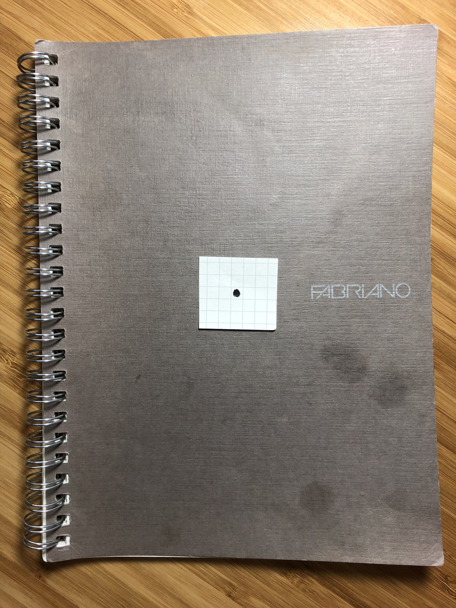
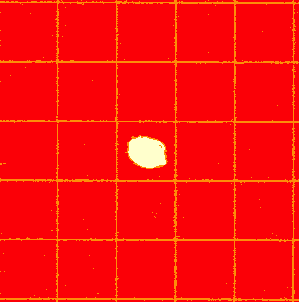
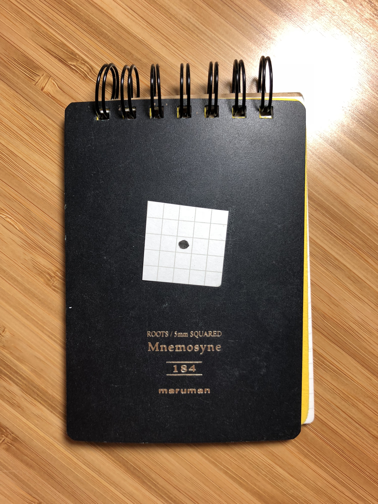
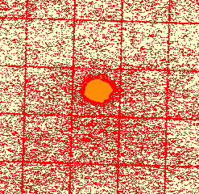

# Graph Paper Analysis

## Usage

Run `make`. That will generate the cluster results in `results/clustered_*.png`, the numerical results in `results.tsv`, and print out those numerical results in a nice table. Read `cluster.R` (it's short) and [https://masonsimon.com/2018/04/16/quantifying-graph-paper-quality/](the writeup), for more details.

## Equipment

1. Canon Pixma MG5320 Scanner
2. Pigma Micron 005 Black Ink Pen
3. Various gridded notebooks
4. Scissors
5. iPhone X (camera)
6. My Hackintosh with 40" Display

## Procedure

For each notebook,
1. Cut a small square of graph paper.
2. Draw an ink dot within a grid square by circling pen around one point.
3. Photograph this paper section on top of notebook it came from.
4. Scan in black & white at 300 DPI in PNG format (to avoid compression artifacts). With care taken to position paper in same position in scanner each time.
5. Crop scanned image within borders of grid paper so that only the paper is visible (no white background of the scanner).
6. Run through analysis script (`cluster.R`).

## Results

| Description | Notebook | Scan | Clusters | Background | Gridlines | Inkdot | Ink/Grid Ratio |
| ----------- | -------- | ---- | -------- | ---------- | --------- | ------ | -------------- |
| 7-11_notepad_s_86x135mm_5mm |  |  |  | 0.04 | 0.11 | 0.81 | 7.27 |
| 7-11_ring_note_a6_y |  |  |  | 0.04 | 0.10 | 0.80 | 7.90 |
| alvin_ALGO8 |  |  |  | 0.03 | 0.25 | 0.80 | 3.22 |
| bienfang |  |  |  | 0.04 | 0.07 | 0.82 |11.88 |
| brown_noname |  |  |  | 0.04 | 0.11 | 0.81 | 7.16 |
| cac.rea_a4_9 |  |  |  | 0.03 | 0.06 | 0.82 |14.44 |
| conception_estranger_di_costarica_b6 |  |  |  | 0.04 | 0.17 | 0.80 | 4.63 |
| fabriano_ecoqua |  |  |  | 0.03 | 0.16 | 0.80 | 5.08 |
| kokuyo_campus_5mm_colorful |  |  |  | 0.07 | 0.10 | 0.79 | 7.96 |
| kokuyo_campus_s5 |  |  |  | 0.04 | 0.10 | 0.81 | 8.37 |
| kokuyo_filler_a5_new |  |  |  | 0.03 | 0.11 | 0.78 | 7.38 |
| kokuyo_filler_a5_old |  |  |  | 0.04 | 0.14 | 0.79 | 5.66 |
| maruman_mnemosyne_roots_5mm |  |  |  | 0.04 | 0.13 | 0.80 | 5.99 |
| maruman_n767_mps600 |  |  |  | 0.04 | 0.07 | 0.81 |12.05 |
| maruman_spiral_note_5mm |  |  |  | 0.05 | 0.11 | 0.80 | 7.44 |
| okina_project_paper_65x90_5mm |  |  |  | 0.03 | 0.06 | 0.81 |14.11 |
